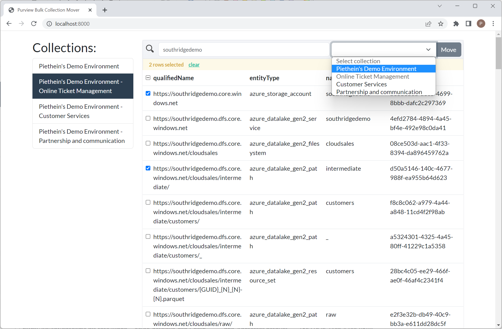

## Purview Bulk Collection Mover
Copyright (c) 2023 Piethein Strengholt, piethein@strengholt-online.nl

### Background
This application is designed to quickly perform bulk move operations between collections in Microsoft Purview. This is often needed when you scan shared services, such as Azure Data Factory or PowerBI. With this application, the management of moving entities between collections is a redemption. You select a collection, search, filter, check, select the target collection, and you're done.The application is written in JavaScript: Vue.js 3 for the frontend and Express for the backend. It uses Bootstrap for making the design responsive. 

### Prerequisites
* NodeJS 16.x or higher
* Git
* [Service principal with Root collection rights](https://learn.microsoft.com/en-us/azure/purview/tutorial-using-rest-apis)

### How to get everything installed
* Clone this repository
* Run `npm install` in both the `client` and `server` folder
* Find the `.env.example` file in the root of both the `client` and `server` folder. Copy and rename the files to `.env`
* Edit `.env` inside the `server` folder and enter the information needed for the service principal, such as AZURE_CLIENT_ID, AZURE_TENANT_ID, AZURE_CLIENT_SECRET and ENDPOINT. Note that the endpoint uses the style: https://<catalog>.purview.azure.com
* Edit `.env` inside the `client` folder. Change the VITE_APP_HOSTNAME, so it points to the back-end.

### Development
If you would like to run this app in development mode I recommend to run:
- Inside the client folder: `npm run dev`.
- Inside the server folder: `npm run debug`.

### Production
If you would like to run this app in production mode I recommend to run:
- Inside the client folder build all the static files with: `npm run build`.
- Move the `dist` output folder created inside the `client` folder to the `server` folder. The NodeJS server is also capable of serving out static content.
- Inside the server folder: `npm run start`.